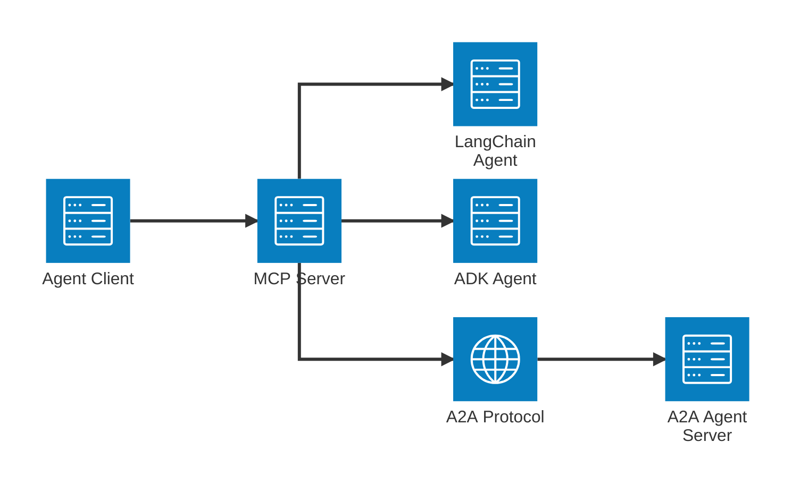
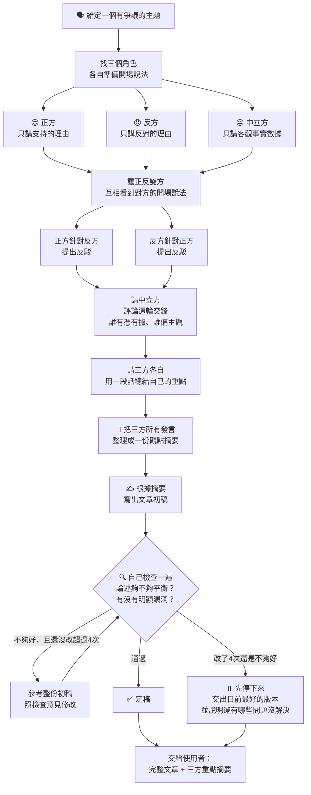
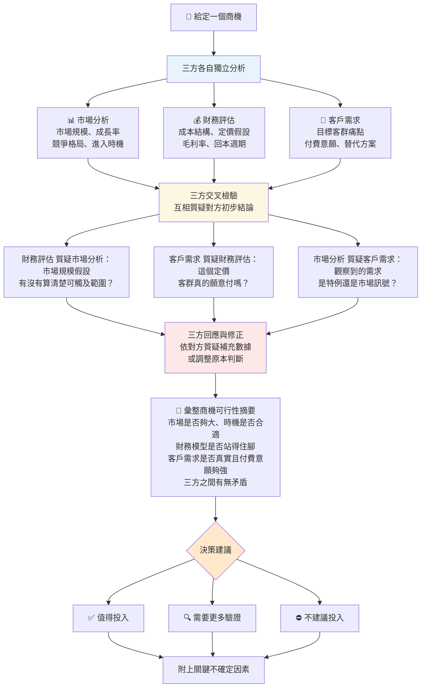

# a2a_mcp

把 **Google ADK**、**A2A（Agent2Agent）**、**LangChain** 三種不同後端的 agent，統一包裝成 MCP tool 的 [FastMCP](https://gofastmcp.com) server。

不管背後是哪種框架，每個 agent 對外都是同一個介面：

```
agent_tool(user_message: str, thread_id: str | None = None) -> {ai_message: str, thread_id: str}
```

- `thread_id` 不帶 → 開新對話；帶上一輪回傳的 `thread_id` → 延續同一段對話。
- agent 放進對應目錄就會自動註冊成一個 MCP tool，**目錄名稱就是 tool 名稱**，不用改 server 程式碼。
- agent 本身也能掛外部 MCP 工具（例如 [Exa](https://exa.ai) 網路搜尋），分析時會先查資料再回答。

## 架構



Agent Client 透過 MCP 呼叫 MCP Server；LangChain 與 ADK agent 在 MCP Server 內直接執行，A2A agent 則跑在獨立的 A2A Agent Server，MCP Server 透過 A2A protocol 呼叫它。

## 專案結構

```
agent_mcp/
├── src/a2a_mcp/
│   ├── agents/
│   │   ├── adk/{name}/agent.py          # ADK agent，匯出 root_agent
│   │   ├── a2a/{name}/agent_card.json   # 遠端 A2A agent 的 agent card
│   │   └── langchain/{name}/agent.py    # LangChain agent，匯出 build_agent(checkpointer)
│   ├── services/                        # 三種後端的 agent_tool 實作
│   ├── settings.py                      # 讀 .env 的設定
│   └── server.py                        # MCP server 進入點
├── adk_agent/                           # 呼叫這個 MCP server 的 ADK orchestrator（client 端）
│   ├── orchestrator/                    # 辯論流程主持人
│   └── opportunity_moderator/           # 商機評估三方討論主持人
├── docs/
│   ├── 辯論流程圖.md
│   └── 商機評估三方討論流程.md
├── pyproject.toml
└── requirements.txt
```

## 內建的 agent

| Tool 名稱 | 後端 | 角色 |
|---|---|---|
| `debate_pro` | ADK | 辯論正方：只講支持的理由 |
| `debate_con_a2a` | A2A | 辯論反方：只講反對的理由 |
| `debate_neutral` | LangChain | 辯論中立方：只講客觀事實數據 |
| `market_analysis` | ADK | 商機評估：市場規模、成長率、競爭格局、進入時機 |
| `financial_evaluation_a2a` | A2A | 商機評估：成本結構、定價、毛利率、回本週期 |
| `customer_needs` | LangChain | 商機評估：客群痛點、付費意願、替代方案 |

商機評估的三個 agent 都掛了 Exa MCP（`https://mcp.exa.ai/mcp`，免 API key），會先用 `web_search_exa` 查資料，不夠詳細才用 `web_fetch_exa` 抓完整頁面，再給出判斷。

## 安裝

需要 Python 3.12 以上。在 repo 根目錄：

```bash
pip install -e .
```

不想用 editable install 的話也可以：

```bash
pip install -r requirements.txt
```

## 設定

複製設定範本，填入 Gemini API 金鑰（到 [Google AI Studio](https://aistudio.google.com/apikey) 申請）：

```bash
cp .env.example .env
```

`.env` 至少要設定這幾項，才能用 HTTP 方式提供服務：

```
GOOGLE_API_KEY=你的金鑰
FASTMCP_TRANSPORT=http
FASTMCP_HOST=127.0.0.1
FASTMCP_PORT=8000
```

選填：用 `ADK_AGENT_NAMES`／`A2A_AGENT_NAMES`／`LANGCHAIN_AGENT_NAMES`（逗號分隔）只註冊指定的 agent，不設定則自動註冊對應目錄底下全部：

```
ADK_AGENT_NAMES=debate_pro,market_analysis
A2A_AGENT_NAMES=debate_con_a2a,financial_evaluation_a2a
LANGCHAIN_AGENT_NAMES=debate_neutral,customer_needs
```

`adk_agent/orchestrator/` 和 `adk_agent/opportunity_moderator/` 底下也各需要一份 `.env`（同樣放 `GOOGLE_API_KEY`），這兩份不會進版控。

## 啟動服務

以下指令都在 repo 根目錄執行。

**1. 啟動 A2A server**（`debate_con_a2a`、`financial_evaluation_a2a` 這兩個 A2A tool 背後的 agent 由它提供）：

```bash
adk api_server --a2a --port 3000 src/a2a_mcp/agents/adk
```

**2. 啟動 MCP server**：

```bash
python -m a2a_mcp.server
```

啟動後 MCP endpoint 在 `http://127.0.0.1:8000/mcp`。三個掛了 Exa 的 agent 建構時會先連一次 Exa，啟動需要多等幾秒到幾十秒。

## 使用範例

### 範例一：辯論流程（`adk_agent/orchestrator`）

給一個有爭議的主題，由主持人協調正方、反方、中立方三方發言，最後寫出一篇平衡的評論文章。

```bash
adk web adk_agent
```

在瀏覽器打開 ADK Web UI，選 `orchestrator`，輸入主題，例如：

> 城市應該全面禁止私人汽車進入市中心

完整流程說明見 [docs/辯論流程圖.md](docs/辯論流程圖.md)：



輸出會包含【定稿】（完整文章）和【產出過程摘要】（三方各自的論點、反詰與重申重點）。

### 範例二：商機評估三方討論（`adk_agent/opportunity_moderator`）

給一個商機，由主持人協調市場分析、財務評估、客戶需求三方評估，最後給出「可以做 / 再多調查 / 先不要做」的建議。三方不是對立辯論，而是互相拿對方的結論來檢驗自己。

```bash
adk web adk_agent
```

在瀏覽器打開 ADK Web UI，選 `opportunity_moderator`，輸入商機，例如：

> 推出一款針對台灣中小企業的 AI 客服 SaaS 產品

完整流程說明見 [docs/商機評估三方討論流程.md](docs/商機評估三方討論流程.md)：



實作上，主持人在派工前會先用 Exa 查一次這個商機的產業背景與市場新聞，整理成摘要一起提供給三方當共同素材。輸出格式：

```
【一句話結論】市場好不好、划不划算、客戶要不要買單
【商機可行性摘要】三方各自的初步看法與被提問後的結論
【決定怎麼做】✅ 可以做 / 🔍 再多調查 / ⛔ 先不要做
【還沒把握的地方】...
```

兩個主持人都用 `tool_filter` 只看得到自己那三個 tool，同一個 MCP server 上的另一組 agent 不會被誤叫。

## 新增自己的 agent

在對應目錄新增一個子目錄，重啟 MCP server 就會自動變成新的 tool：

- **ADK**：`src/a2a_mcp/agents/adk/{name}/agent.py` 匯出 `root_agent`，加一個 `__init__.py`（內容 `from . import agent`）。
- **LangChain**：`src/a2a_mcp/agents/langchain/{name}/agent.py` 匯出 `build_agent(checkpointer)`，回傳 `create_agent(...)` 的結果；model 字串要帶 provider 前綴，例如 `google_genai:gemini-3.5-flash-lite`。
- **A2A**：`src/a2a_mcp/agents/a2a/{name}/agent_card.json`，內容是遠端 agent `GET {url}/.well-known/agent-card.json` 的回應。

有設定 `*_AGENT_NAMES` 的話，記得把新名稱加進去。
