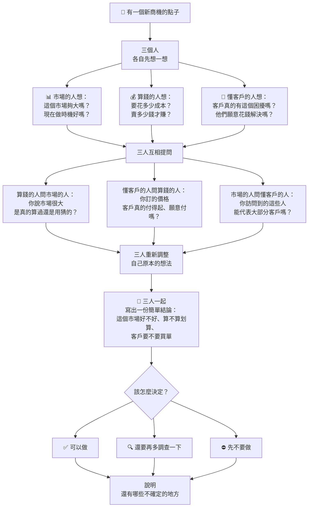

# 商機評估討論流程（簡化版）

市場分析、財務評估、客戶需求三個角色一起評估一個商機，不是吵架辯論，而是互相檢查對方的想法有沒有道理。

## 流程說明（白話版）

1. **各自先想一想**：市場、算錢、懂客戶三個人，各自先憑自己的專業提出初步看法，不互相討論。
2. **三人互相提問**：
   - 算錢的人問市場的人：你說的市場規模，是有根據，還是憑感覺?
   - 懂客戶的人問算錢的人：你訂的價格，客戶真的願意付嗎？
   - 市場的人問懂客戶的人：你問到的這些客戶，能代表大多數人嗎？
3. **重新調整想法**：每個人聽了對方的質疑後，補充資料或修改自己原本的判斷。
4. **寫出結論**：三人一起把最後的看法整理成一份簡單的結論——市場好不好、划不划算、客戶要不要買單。
5. **決定怎麼做**：根據結論，選「可以做 / 再多調查 / 先不要做」，並說清楚還有哪些地方沒把握。
