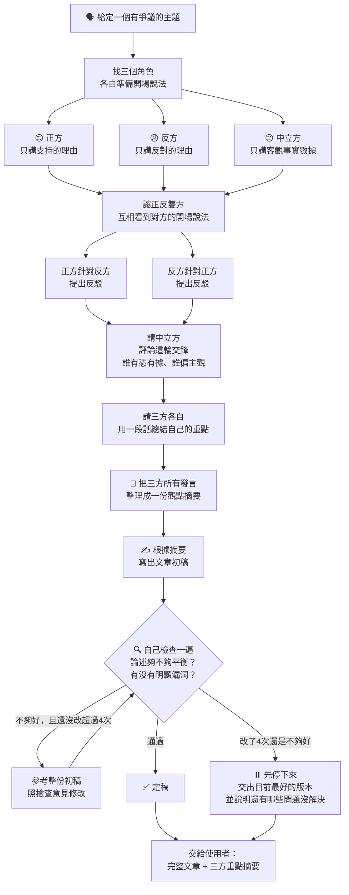

# 爭議性評論文章 — 辯論協調流程

以下流程圖說明協調者如何取得正/反/中立三方觀點，彙整、撰稿並自我審查，直到產出定稿。

## 流程說明

1. **開場立論**：正方、反方、中立方各自獨立準備開場說法，互不參考。
2. **交叉反詰**：正反雙方看到對方的開場論點後，各自提出反駁。
3. **中立方講評**：中立方針對這輪交鋒做客觀分析，指出哪些論點有資料支持、哪些偏主觀推論。
4. **三方重申重點**：三方各自用一小段話總結自己最核心的主張。
5. **彙整摘要**：把三方所有發言整理成一份完整的觀點摘要。
6. **撰寫初稿**：根據摘要寫出文章第一版。
7. **自我審查**：檢查論述是否平衡、有無漏洞，不通過則參考整份初稿修改，最多重複 4 次。
8. **輸出定稿**：審查通過即完稿；若 4 次仍未通過，則交出目前最佳版本並附註未解決的問題。
